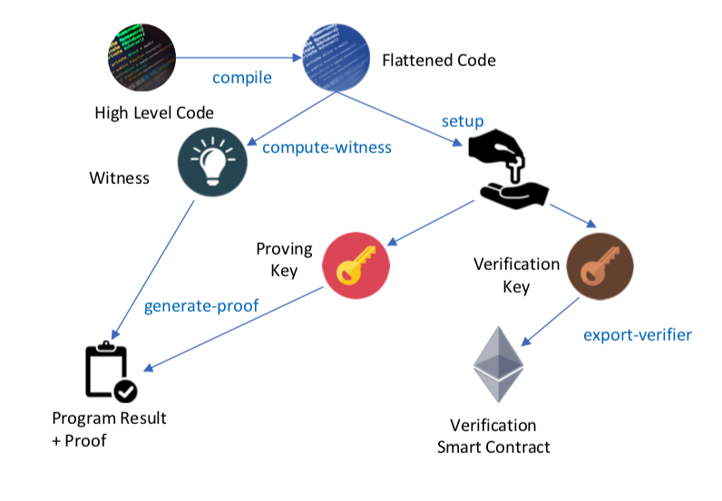
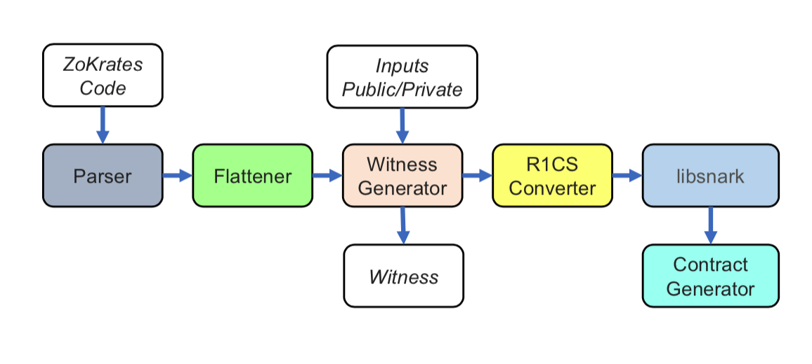

# zkp Zokrates

In the following zkSNARKs example(s) we shall use the Zokrates framework



This is a 5 step process
1. compile program
2. trusted setup
3. compute-witness
4. generate-proof
5. export-verifier


## Input file(s)
* program_name.code


## Output file(s)
* out.code
* out
* proving.key
* verification.key
* variables.inf
* witness
* proof.json
* verifier.sol


## General Commands

Run zokrates inside a docker container as it has certain dependencies 
that are os specific and libsnark, a c++ library is needed



`docker run -v <path to your project folder>:/home/zokrates/code -ti zokrates/zokrates /bin/bash`

Compile the program written in zokrates DSL

`/path/to/zokrates compile -i <program_name>.code`

Now take the 'flattened' code, which is a circuit and go through a 'trusted setup'
Repeat this process, everytime the program.code changes
Two keys are generated - 'proving.key' and 'verification.key'

`/path/to/zokrates setup`

Having gone through the 'trusted setup' let's compute our 'witness' who knows the answer
and it generates a witness file with computation steps

`/path/to/zokrates compute-witness -a <a> <b> ... <n>`

Next step is to 'generate our proof' based on the above 'witness'
A `proof.json` file is generated in this step

`/path/to/zokrates generate-proof`

Last but never the least, let's generate our 'verifier' smart contract

`path/to/zokrates export-verifier`


## Commands for example: **square.code**

The boiler plate code for `square.code` is provided to help your accelerated learning

Go through the steps by executing the following commands

`docker run -v /Users/pk/Documents/code/udacity/nd1309/course-7/project-8/zokrates/code:/home/zokrates/code -ti zokrates/zokrates /bin/bash`
```
zokrates@ec46fd6b5c34:~$
```
`cd code/square`
```
zokrates@ec46fd6b5c34:~/code/square$
```
`~/zokrates compile -i square.code`
```
Compiling square.code
Compiled program:
def main(private _2,_3):
        _4 = (_2 * _2)
        _5 = (_4 - _3)
        # _6, _7 = Rust::ConditionEq(_5)
        _6 == (_5 * _7)
        _8 = (1 - _6)
        0 == (_8 * _5)
        # _9 = Rust::Identity(_8)
        _10 = (1 - _9)
        _11 = (_9 * 1)
        _12 = (_10 * 0)
        _13 = (_11 + _12)
        return _13
Compiled code written to 'out'
Human readable code to 'out.code'
Number of constraints: 12
```
`~/zokrates setup`
```
Performing setup...
def main(private _2,_3):
        _4 = (_2 * _2)
        _5 = (_4 - _3)
        # _6, _7 = Rust::ConditionEq(_5)
        _6 == (_5 * _7)
        _8 = (1 - _6)
        0 == (_8 * _5)
        # _9 = Rust::Identity(_8)
        _10 = (1 - _9)
        _11 = (_9 * 1)
        _12 = (_10 * 0)
        _13 = (_11 + _12)
        return _13
num variables: 14
num constraints: 10
num inputs: 2
Swap is not beneficial, not performing
* QAP number of variables: 13
* QAP pre degree: 10
* QAP degree: 16
* QAP number of input variables: 2
* G1 window: 5
* G2 window: 1
* G1 elements in PK: 109
* Non-zero G1 elements in PK: 83
* G2 elements in PK: 15
* Non-zero G2 elements in PK: 5
* PK size in bits: 25438
* G1 elements in VK: 4
* G2 elements in VK: 5
* VK size in bits: 3948
        Verification key in Solidity compliant format:{
                vk.A = Pairing.G2Point([0x1b10d49529b9fdb453db13c92e84ab5dc45334453042191e478b4af992319a14, 0x46eb90b54936dd919ec0bc78841dab711a4f79b8f362d1bf5be1f20f707a8b2], [0xe49b9c594d9e62f24a2a297054816ea2c91df4fb3e38640e66de63cfd817e8d, 0x9dcd6d2181b6036cc0e6e7f7a6b4fbbd687df1d389456c4e8f867e4cb88fbbd]);
                vk.B = Pairing.G1Point(0xe6def06b94364c38e5b7984ccdb60023c48b5bd8e991c05997fe9333b04158f, 0xcc9860476d5fc85ab2ec2b409cc2210a76929845f73205f957880bb3b16ecd8);
                vk.C = Pairing.G2Point([0x10e32a50bc3260c7febf42975de3650fe4a7139bd0257d21733a9ced3ff390c1, 0x1bd239069e98b09e76e6c132b38d013f6ec8915b7da57db6b455fc290bf471bb], [0x27591b27d811d8c2b62d03c179f91dbb7f2d24bb17add3d63b994b7f89514150, 0x2a9ec752977ffc91e31cd27f9cbbb3ad911e262eb5f8c7ede68d6ebc3a92f8a5]);
                vk.gamma = Pairing.G2Point([0x1f0c6a2f09a9670bf6c7d972e95c6e5a930142cefeea38e4a87f24921ac2592d, 0x4f331535b42f312a87d12b1047ba5a988731ff64c66b06b60430481882d0d88], [0x1f43a3146ad6acfc9dac398a7f4e371dc04083b276a1d0f4d3328d9593d9aa99, 0x2a8b26dad1546f3e2e0608e7404d4c3e2a62dda46e9ef60b87f4da1737c306ad]);
                vk.gammaBeta1 = Pairing.G1Point(0x37b0008f481e55f95dba689e98d4aaa6b71ae388a3894c7c29ce70e0d9a68f1, 0x28581ffa3f9e9ccc7e326e28fb631f66a99b3765de414d0dcc14744e503288c5);
                vk.gammaBeta2 = Pairing.G2Point([0x2a3576b33a12081980916faf04f10da2303dbc02997243ac504310a4280a6a82, 0x41037b2c7f4e47443ae93edfcf3f0567f6efab375490fc623fcb43ddd43fc8], [0x2fda20f1bf8bb0582dc6d86ab5e54e642dcbc84a6c2dd8946d2e9a264e85218b, 0x17c4835f6f0187700e3db9011de120096b6a2cc70ccad3f4316b46a36f665cc3]);
                vk.Z = Pairing.G2Point([0x2c24ab08b2553394d1bf14eea008cf048cfd04a76985520f7298cf3193a83b94, 0x2a78e1cead84d701d260b4501bc10f8484a4634af0804f7618f5d4d5810264c0], [0x9bc0f8c060d83b583f26c6246e73542ed2508f540bd1d8a6fd76c613b7539ac, 0x13d754c72b2bd74366f90e0820de110b131d7cb4938ca7bd32fbdd7692d72f8f]);
                vk.IC = new Pairing.G1Point[](3);
                vk.IC[0] = Pairing.G1Point(0x22b868e2f6fb09d53ecd062cea60d26b1ab399850dbc6884d27d2635819508a2, 0x282098aeb5ff8fda56c6c706b16a8ff48c0252baf2e5eba3dcd1244f0dd35ed7);
                vk.IC[1] = Pairing.G1Point(0x121a1b6b5d1b609797437a11887c852395552ca480d0628a820b0b497ffd7bb8, 0x2f21165ef531364662970aedf0709ca52dacbc993e6e4f8e1e9dd55372ea6a78);
                vk.IC[2] = Pairing.G1Point(0xf10b3c22875fbe19c4fe8566ef1c69c4ba33cd6080a6caa8a5839a8ad0378c5, 0xebde646e2e341e1179d2d0f6a8810592f2dd41b99c0a586a014ca9b12fb5fdd);
                }
setup successful: true
```
`~/zokrates compute-witness -a 3 9`
```
Computing witness for:
def main(private _2,_3):
        _4 = (_2 * _2)
        _5 = (_4 - _3)
        # _6, _7 = Rust::ConditionEq(_5)
        _6 == (_5 * _7)
        _8 = (1 - _6)
        0 == (_8 * _5)
        # _9 = Rust::Identity(_8)
        _10 = (1 - _9)
        _11 = (_9 * 1)
        _12 = (_10 * 0)
        _13 = (_11 + _12)
        return _13

Witness:

~out_0 1
```
`~/zokrates generate-proof`
```
Generating proof...
Using Witness: {"_8": 1, "~one": 1, "_2": 3, "_7": 1, "_13": 1, "_3": 9, "_9": 1, "_6": 0, "~out_0": 1, "_10": 0, "_11": 1, "_12": 0, "_5": 0, "_4": 9}
Public inputs: [1, 9, 1]
Private inputs: [3, 9, 0, 1, 0, 1, 0, 1, 1, 0, 1]
* Elements of w skipped: 3 (33.33%)
* Elements of w processed with special addition: 4 (44.44%)
* Elements of w remaining: 2 (22.22%)
* Elements of w skipped: 1 (33.33%)
* Elements of w processed with special addition: 1 (33.33%)
* Elements of w remaining: 1 (33.33%)
* Elements of w skipped: 4 (36.36%)
* Elements of w processed with special addition: 5 (45.45%)
* Elements of w remaining: 2 (18.18%)
* Elements of w skipped: 4 (30.77%)
* Elements of w processed with special addition: 6 (46.15%)
* Elements of w remaining: 3 (23.08%)
* G1 elements in proof: 7
* G2 elements in proof: 1
* Proof size in bits: 2294
Proof:
A = Pairing.G1Point(0x10011bb0ae2830e7aac3a8018a35cb5bcf7e9b7e1f1f978659617bb8963dc9eb, 0x1e1bfa48eea252e9af7a640692efd7a9621196f199449297eb15f0de55f48e2);
A_p = Pairing.G1Point(0x208b8d0290c0aae78f7a68e4eeb279d5acef98440f6362f89be509dfb30cac7b, 0x13483c8e6250415dc769d1df23ebd0685e706dc9ccb8a6531656ac752d1c38be);
B = Pairing.G2Point([0xdbbdb9a1b3840a906e4e8c45262331c4b6ef4331f72a5febcb2b9bb0ae0ad93, 0x1f8f59715f8bed2d88f7424a185d126caada6510ee9c58931fbf8ce41e0226e4], [0x26050966f8c53a0ede7802029b7480445299a60c6668398c2710c94130513927, 0x15357ed970d284c59adf8ea5e2cec0afc3ca037ab88b7d77538f73b87e652307]);
B_p = Pairing.G1Point(0x2e3a1b6396d4ba1e4b8534770686f936f6fd7263a482e6ea21d7a71f6fc1b38a, 0x291bc498d964af16a6c0a43faf69370d901d59045eaf9e9480f630c2796e44b1);
C = Pairing.G1Point(0x345efb9b94c2e35ddb250ae37d7b9d9bca1ca25ed015f2866291ef5b56bceed, 0xcf8e6bc23944b5c8877dfcd4d19dc131dc41f366ed95b3d7d654642f02a60cb);
C_p = Pairing.G1Point(0xcf6854e67af66797ea0b4f199b17dd2297a46c772d554a61b47a05ec0c7eaf0, 0x2824aec96561b59ec9dafe69b84873a7b2976d809187f8a2db1875ac794b0e3e);
H = Pairing.G1Point(0x21e5e352a944783143e0bae49067d07e447e091fdaaa1e5b8db52204762b5932, 0x24daf7d76d6cda133ea472e8ffe212b4dd28b1f30927d979eefb3b743488e441);
K = Pairing.G1Point(0x14c4c91906fdabe4bc5fc90fd94f4d2828de747f910beac74c7362245f515595, 0x17792bd44e9fa943517b6586c452734e438bf3e0e5c09e89054e540cec76e0e8);
generate-proof successful: true
```
`~/zokrates export-verifier`
```
Exporting verifier...
Finished exporting verifier.
```

### verifier.sol

```
// This file is MIT Licensed.
//
// Copyright 2017 Christian Reitwiessner
// Permission is hereby granted, free of charge, to any person obtaining a copy of this software and associated documentation files (the "Software"), to deal in the Software without restriction, including without limitation the rights to use, copy, modify, merge, publish, distribute, sublicense, and/or sell copies of the Software, and to permit persons to whom the Software is furnished to do so, subject to the following conditions:
// The above copyright notice and this permission notice shall be included in all copies or substantial portions of the Software.
// THE SOFTWARE IS PROVIDED "AS IS", WITHOUT WARRANTY OF ANY KIND, EXPRESS OR IMPLIED, INCLUDING BUT NOT LIMITED TO THE WARRANTIES OF MERCHANTABILITY, FITNESS FOR A PARTICULAR PURPOSE AND NONINFRINGEMENT. IN NO EVENT SHALL THE AUTHORS OR COPYRIGHT HOLDERS BE LIABLE FOR ANY CLAIM, DAMAGES OR OTHER LIABILITY, WHETHER IN AN ACTION OF CONTRACT, TORT OR OTHERWISE, ARISING FROM, OUT OF OR IN CONNECTION WITH THE SOFTWARE OR THE USE OR OTHER DEALINGS IN THE SOFTWARE.

pragma solidity ^0.4.14;
library Pairing {
    struct G1Point {
        uint X;
        uint Y;
    }
    // Encoding of field elements is: X[0] * z + X[1]
    struct G2Point {
        uint[2] X;
        uint[2] Y;
    }
    /// @return the generator of G1
    function P1() pure internal returns (G1Point) {
        return G1Point(1, 2);
    }
    /// @return the generator of G2
    function P2() pure internal returns (G2Point) {
        return G2Point(
            [11559732032986387107991004021392285783925812861821192530917403151452391805634,
             10857046999023057135944570762232829481370756359578518086990519993285655852781],
            [4082367875863433681332203403145435568316851327593401208105741076214120093531,
             8495653923123431417604973247489272438418190587263600148770280649306958101930]
        );
    }
    /// @return the negation of p, i.e. p.addition(p.negate()) should be zero.
    function negate(G1Point p) pure internal returns (G1Point) {
        // The prime q in the base field F_q for G1
        uint q = 21888242871839275222246405745257275088696311157297823662689037894645226208583;
        if (p.X == 0 && p.Y == 0)
            return G1Point(0, 0);
        return G1Point(p.X, q - (p.Y % q));
    }
    /// @return the sum of two points of G1
    function addition(G1Point p1, G1Point p2) internal returns (G1Point r) {
        uint[4] memory input;
        input[0] = p1.X;
        input[1] = p1.Y;
        input[2] = p2.X;
        input[3] = p2.Y;
        bool success;
        assembly {
            success := call(sub(gas, 2000), 6, 0, input, 0xc0, r, 0x60)
            // Use "invalid" to make gas estimation work
            switch success case 0 { invalid() }
        }
        require(success);
    }
    /// @return the product of a point on G1 and a scalar, i.e.
    /// p == p.scalar_mul(1) and p.addition(p) == p.scalar_mul(2) for all points p.
    function scalar_mul(G1Point p, uint s) internal returns (G1Point r) {
        uint[3] memory input;
        input[0] = p.X;
        input[1] = p.Y;
        input[2] = s;
        bool success;
        assembly {
            success := call(sub(gas, 2000), 7, 0, input, 0x80, r, 0x60)
            // Use "invalid" to make gas estimation work
            switch success case 0 { invalid() }
        }
        require (success);
    }
    /// @return the result of computing the pairing check
    /// e(p1[0], p2[0]) *  .... * e(p1[n], p2[n]) == 1
    /// For example pairing([P1(), P1().negate()], [P2(), P2()]) should
    /// return true.
    function pairing(G1Point[] p1, G2Point[] p2) internal returns (bool) {
        require(p1.length == p2.length);
        uint elements = p1.length;
        uint inputSize = elements * 6;
        uint[] memory input = new uint[](inputSize);
        for (uint i = 0; i < elements; i++)
        {
            input[i * 6 + 0] = p1[i].X;
            input[i * 6 + 1] = p1[i].Y;
            input[i * 6 + 2] = p2[i].X[0];
            input[i * 6 + 3] = p2[i].X[1];
            input[i * 6 + 4] = p2[i].Y[0];
            input[i * 6 + 5] = p2[i].Y[1];
        }
        uint[1] memory out;
        bool success;
        assembly {
            success := call(sub(gas, 2000), 8, 0, add(input, 0x20), mul(inputSize, 0x20), out, 0x20)
            // Use "invalid" to make gas estimation work
            switch success case 0 { invalid() }
        }
        require(success);
        return out[0] != 0;
    }
    /// Convenience method for a pairing check for two pairs.
    function pairingProd2(G1Point a1, G2Point a2, G1Point b1, G2Point b2) internal returns (bool) {
        G1Point[] memory p1 = new G1Point[](2);
        G2Point[] memory p2 = new G2Point[](2);
        p1[0] = a1;
        p1[1] = b1;
        p2[0] = a2;
        p2[1] = b2;
        return pairing(p1, p2);
    }
    /// Convenience method for a pairing check for three pairs.
    function pairingProd3(
            G1Point a1, G2Point a2,
            G1Point b1, G2Point b2,
            G1Point c1, G2Point c2
    ) internal returns (bool) {
        G1Point[] memory p1 = new G1Point[](3);
        G2Point[] memory p2 = new G2Point[](3);
        p1[0] = a1;
        p1[1] = b1;
        p1[2] = c1;
        p2[0] = a2;
        p2[1] = b2;
        p2[2] = c2;
        return pairing(p1, p2);
    }
    /// Convenience method for a pairing check for four pairs.
    function pairingProd4(
            G1Point a1, G2Point a2,
            G1Point b1, G2Point b2,
            G1Point c1, G2Point c2,
            G1Point d1, G2Point d2
    ) internal returns (bool) {
        G1Point[] memory p1 = new G1Point[](4);
        G2Point[] memory p2 = new G2Point[](4);
        p1[0] = a1;
        p1[1] = b1;
        p1[2] = c1;
        p1[3] = d1;
        p2[0] = a2;
        p2[1] = b2;
        p2[2] = c2;
        p2[3] = d2;
        return pairing(p1, p2);
    }
}
contract Verifier {
    using Pairing for *;
    struct VerifyingKey {
        Pairing.G2Point A;
        Pairing.G1Point B;
        Pairing.G2Point C;
        Pairing.G2Point gamma;
        Pairing.G1Point gammaBeta1;
        Pairing.G2Point gammaBeta2;
        Pairing.G2Point Z;
        Pairing.G1Point[] IC;
    }
    struct Proof {
        Pairing.G1Point A;
        Pairing.G1Point A_p;
        Pairing.G2Point B;
        Pairing.G1Point B_p;
        Pairing.G1Point C;
        Pairing.G1Point C_p;
        Pairing.G1Point K;
        Pairing.G1Point H;
    }
    function verifyingKey() pure internal returns (VerifyingKey vk) {
        vk.A = Pairing.G2Point([0x1b10d49529b9fdb453db13c92e84ab5dc45334453042191e478b4af992319a14, 0x46eb90b54936dd919ec0bc78841dab711a4f79b8f362d1bf5be1f20f707a8b2], [0xe49b9c594d9e62f24a2a297054816ea2c91df4fb3e38640e66de63cfd817e8d, 0x9dcd6d2181b6036cc0e6e7f7a6b4fbbd687df1d389456c4e8f867e4cb88fbbd]);
        vk.B = Pairing.G1Point(0xe6def06b94364c38e5b7984ccdb60023c48b5bd8e991c05997fe9333b04158f, 0xcc9860476d5fc85ab2ec2b409cc2210a76929845f73205f957880bb3b16ecd8);
        vk.C = Pairing.G2Point([0x10e32a50bc3260c7febf42975de3650fe4a7139bd0257d21733a9ced3ff390c1, 0x1bd239069e98b09e76e6c132b38d013f6ec8915b7da57db6b455fc290bf471bb], [0x27591b27d811d8c2b62d03c179f91dbb7f2d24bb17add3d63b994b7f89514150, 0x2a9ec752977ffc91e31cd27f9cbbb3ad911e262eb5f8c7ede68d6ebc3a92f8a5]);
        vk.gamma = Pairing.G2Point([0x1f0c6a2f09a9670bf6c7d972e95c6e5a930142cefeea38e4a87f24921ac2592d, 0x4f331535b42f312a87d12b1047ba5a988731ff64c66b06b60430481882d0d88], [0x1f43a3146ad6acfc9dac398a7f4e371dc04083b276a1d0f4d3328d9593d9aa99, 0x2a8b26dad1546f3e2e0608e7404d4c3e2a62dda46e9ef60b87f4da1737c306ad]);
        vk.gammaBeta1 = Pairing.G1Point(0x37b0008f481e55f95dba689e98d4aaa6b71ae388a3894c7c29ce70e0d9a68f1, 0x28581ffa3f9e9ccc7e326e28fb631f66a99b3765de414d0dcc14744e503288c5);
        vk.gammaBeta2 = Pairing.G2Point([0x2a3576b33a12081980916faf04f10da2303dbc02997243ac504310a4280a6a82, 0x41037b2c7f4e47443ae93edfcf3f0567f6efab375490fc623fcb43ddd43fc8], [0x2fda20f1bf8bb0582dc6d86ab5e54e642dcbc84a6c2dd8946d2e9a264e85218b, 0x17c4835f6f0187700e3db9011de120096b6a2cc70ccad3f4316b46a36f665cc3]);
        vk.Z = Pairing.G2Point([0x2c24ab08b2553394d1bf14eea008cf048cfd04a76985520f7298cf3193a83b94, 0x2a78e1cead84d701d260b4501bc10f8484a4634af0804f7618f5d4d5810264c0], [0x9bc0f8c060d83b583f26c6246e73542ed2508f540bd1d8a6fd76c613b7539ac, 0x13d754c72b2bd74366f90e0820de110b131d7cb4938ca7bd32fbdd7692d72f8f]);
        vk.IC = new Pairing.G1Point[](3);
        vk.IC[0] = Pairing.G1Point(0x22b868e2f6fb09d53ecd062cea60d26b1ab399850dbc6884d27d2635819508a2, 0x282098aeb5ff8fda56c6c706b16a8ff48c0252baf2e5eba3dcd1244f0dd35ed7);
        vk.IC[1] = Pairing.G1Point(0x121a1b6b5d1b609797437a11887c852395552ca480d0628a820b0b497ffd7bb8, 0x2f21165ef531364662970aedf0709ca52dacbc993e6e4f8e1e9dd55372ea6a78);
        vk.IC[2] = Pairing.G1Point(0xf10b3c22875fbe19c4fe8566ef1c69c4ba33cd6080a6caa8a5839a8ad0378c5, 0xebde646e2e341e1179d2d0f6a8810592f2dd41b99c0a586a014ca9b12fb5fdd);
    }
    function verify(uint[] input, Proof proof) internal returns (uint) {
        VerifyingKey memory vk = verifyingKey();
        require(input.length + 1 == vk.IC.length);
        // Compute the linear combination vk_x
        Pairing.G1Point memory vk_x = Pairing.G1Point(0, 0);
        for (uint i = 0; i < input.length; i++)
            vk_x = Pairing.addition(vk_x, Pairing.scalar_mul(vk.IC[i + 1], input[i]));
        vk_x = Pairing.addition(vk_x, vk.IC[0]);
        if (!Pairing.pairingProd2(proof.A, vk.A, Pairing.negate(proof.A_p), Pairing.P2())) return 1;
        if (!Pairing.pairingProd2(vk.B, proof.B, Pairing.negate(proof.B_p), Pairing.P2())) return 2;
        if (!Pairing.pairingProd2(proof.C, vk.C, Pairing.negate(proof.C_p), Pairing.P2())) return 3;
        if (!Pairing.pairingProd3(
            proof.K, vk.gamma,
            Pairing.negate(Pairing.addition(vk_x, Pairing.addition(proof.A, proof.C))), vk.gammaBeta2,
            Pairing.negate(vk.gammaBeta1), proof.B
        )) return 4;
        if (!Pairing.pairingProd3(
                Pairing.addition(vk_x, proof.A), proof.B,
                Pairing.negate(proof.H), vk.Z,
                Pairing.negate(proof.C), Pairing.P2()
        )) return 5;
        return 0;
    }
    event Verified(string s);
    function verifyTx(
            uint[2] a,
            uint[2] a_p,
            uint[2][2] b,
            uint[2] b_p,
            uint[2] c,
            uint[2] c_p,
            uint[2] h,
            uint[2] k,
            uint[2] input
        ) public returns (bool r) {
        Proof memory proof;
        proof.A = Pairing.G1Point(a[0], a[1]);
        proof.A_p = Pairing.G1Point(a_p[0], a_p[1]);
        proof.B = Pairing.G2Point([b[0][0], b[0][1]], [b[1][0], b[1][1]]);
        proof.B_p = Pairing.G1Point(b_p[0], b_p[1]);
        proof.C = Pairing.G1Point(c[0], c[1]);
        proof.C_p = Pairing.G1Point(c_p[0], c_p[1]);
        proof.H = Pairing.G1Point(h[0], h[1]);
        proof.K = Pairing.G1Point(k[0], k[1]);
        uint[] memory inputValues = new uint[](input.length);
        for(uint i = 0; i < input.length; i++){
            inputValues[i] = input[i];
        }
        if (verify(inputValues, proof) == 0) {
            emit Verified("Transaction successfully verified.");
            return true;
        } else {
            return false;
        }
    }
}
```